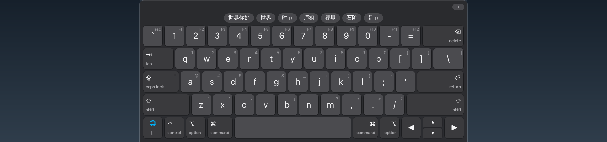
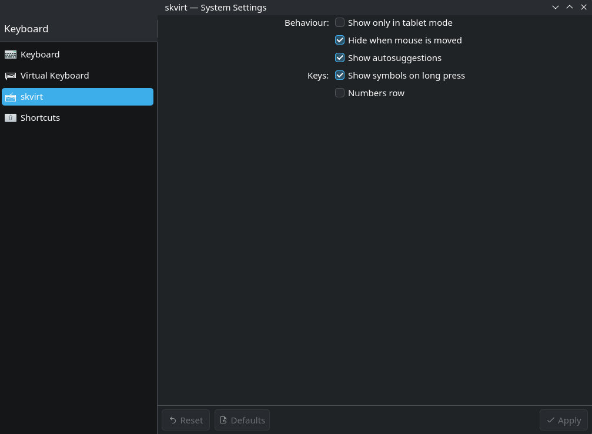

# skvirt

A touch-driven on-screen keyboard for **KDE Plasma / KWin (Wayland)** that works
**with** fcitx5 instead of replacing it.

Unlike input-method-based on-screen keyboards, skvirt does not take over the
Wayland input-method slot and does not put fcitx5 into its virtual-keyboard
mode. It types by creating a **kernel virtual keyboard via `/dev/uinput`**, so
key taps travel the normal input path — libinput → KWin → fcitx5 — exactly like
a physical keyboard. Your active fcitx5 layout and engine (e.g. `keyboard-ru`,
Pinyin) compose the input and show candidates in fcitx5's usual window, and the
fcitx5 tray icon keeps working. fcitx5 never even knows skvirt exists.



## Features

- **macOS-style panel and key set:** the layout of a Mac keyboard — number row,
  the three letter rows framed by `tab` / `caps lock` / `shift` / `return` /
  `delete`, and a bottom row of 🌐 `⌃` `⌥` `⌘` space `⌘` `⌥` plus the
  inverted-T arrow cluster — drawn as a floating slab with square caps, in a
  **light or dark** appearance that can follow the system colour scheme.
  `⌃` `⌥` `⌘` latch like the one-shot Shift: tap one, and the next key is sent
  with it held. 🌐 switches the input source (the fcitx5 IM), and `caps lock`
  has its indicator light.
- **Touch-driven, Windows-like:** touching a text field with a finger/pen pops
  the keyboard up; reaching for the mouse/touchpad/trackpoint, losing the field,
  or pressing the ▼ button hides it. A mouse click never summons it.
- **Coexists with fcitx5:** input goes through fcitx5, so layouts, composing and
  CJK candidate selection all work normally.
- **Autosuggestion bar:** word completions above the key rows — Hunspell
  dictionaries for Latin/Cyrillic layouts, and **libime pinyin candidates**
  (the same engine and data as fcitx5-pinyin) when a Chinese IM is active.
  Tapping a pinyin candidate commits the hanzi directly.
- **Layout generator:** the on-screen rows are generated at runtime from the
  active IM's xkb symbols (`/usr/share/X11/xkb/symbols/*`), so any
  `keyboard-XX` layout (de, fr, …) shows the right legends on all four typing
  rows, dead keys (`^` `´` `¨`) included. Hardcoded QWERTY/ЙЦУКЕН remain as
  fallback.
- **Long-press symbols:** holding a key opens an alternates strip — the
  digit/symbol of its physical position first (`1` on `q`, `@` on `a`, `?` on
  `m`), then the accented variants of the letter on the cap (à á â ä, ё/й, …).
  Slide to pick, release to type. What a key hides is printed small in its
  corner, so the strip is not a secret.
- **Optional function row** — `esc` and F1–F12 across the top. With it off, the
  same keys stay reachable by holding the key below them (and are shown in that
  key's corner): hold `` ` `` for `esc`, `1` for F1, … `=` for F12.
- **Tablet-mode aware:** can auto-show only when the convertible is folded
  into tablet mode (via the `SW_TABLET_MODE` evdev switch).
- **KDE settings module:** *System Settings → skvirt* (KCM) toggles all of
  the above live, no restart needed.
- **Wayland layer-shell** panel docked at the bottom; never steals input focus
  from the application you are typing into.

## Requirements

- KDE Plasma 6 / KWin on Wayland
- Qt 6 (Core, Gui, Quick, Qml, DBus)
- LayerShellQt
- KF6: Config, CoreAddons, I18n, KCMUtils (+ Kirigami at runtime, for the
  settings module)
- **libime** (pinyin suggestions) and **hunspell** (Latin/Cyrillic
  suggestions; dictionaries `hunspell-en_us`, `hunspell-ru`, … install
  separately — without them only pinyin suggestions work)
- fcitx5 as the active input method
- The user must be in the **`input`** group (to read the touchscreen via evdev
  and to write to `/dev/uinput`):

  ```sh
  sudo usermod -aG input "$USER"
  ```

  Log out and back in for the group change to take effect. (For a quick test in
  the current session without re-login: `sg input -c '.../build/skvirt'`.)

## Build

```sh
cmake -B build
cmake --build build
```

## Run

```sh
./build/skvirt
```

Then touch a text field — the keyboard appears. To start it automatically at
login, copy `skvirt.desktop` (adjust the `Exec` path) to
`~/.config/autostart/`, or add the binary in *System Settings → Autostart*.

## Settings

Install (`sudo cmake --install build`) to get the **skvirt** page in System
Settings (or run it from the build tree:
`QT_PLUGIN_PATH=build/bin kcmshell6 kcm_skvirt`). It edits
`~/.config/skvirtrc`; a running skvirt picks changes up live:

- **Show only in tablet mode** — auto-show only while the convertible's
  `SW_TABLET_MODE` switch is engaged.
- **Hide when mouse is moved** — reaching for a pointer device dismisses the
  panel (default on).
- **Show autosuggestions** — completion/candidate bar above the keys.
- **Show symbols on long press** — accent popup on held letters, and F1–F12 on
  the held number row when the function row is off.
- **Function key row** — `esc` and F1–F12 on top; the panel keeps its height
  budget, so the keys shrink to make room.
- **Appearance** — light, dark, or follow the system colour scheme.



(The screenshot predates the appearance and function-row options.)

## How it works

- `UinputKeyboard` — creates the `/dev/uinput` virtual keyboard and injects
  US-position evdev keycodes (with Shift as needed). Output follows the active
  fcitx5 layout/IM, per window. Arbitrary Unicode (hanzi candidates, accented
  letters) goes through fcitx5's unicode addon direct mode (Ctrl+Shift+U,
  hex, Enter).
- `InputMonitor` — reads `/dev/input/event*` and classifies devices by kernel
  properties (`INPUT_PROP_DIRECT` = touchscreen vs pointer devices) to tell
  finger/pen from mouse; also tracks the `SW_TABLET_MODE` switch.
- `KWinVk` — asks KWin (`org.kde.kwin.VirtualKeyboard`) whether the focused
  window accepts text input, to know when there is a field to type into.
- `KeyboardWindow` — the layer-shell panel; marked
  `Qt::WindowDoesNotAcceptFocus` so mapping it never pulls focus off the app.
- `SuggestionEngine` — word completions: Hunspell dictionaries for keyboard
  layouts, libime (`PinyinIME` + `sc.dict` + `zh_CN.lm`) for pinyin IMs.
- `LayoutGenerator` — parses the active layout's xkb symbols into the four QML
  typing rows (number row + AD/AC/AB), keeping their US-position names so keys
  commit by physical position.
- `MacTheme.qml` — the light/dark palette (and the SF Pro → Inter → Noto Sans
  font fallback) every key paints from.
- `SettingsBridge` + `kcm/` — KConfigXT settings (`skvirtrc`) shared with a
  KQuickManagedConfigModule KCM; `KConfigWatcher` reloads them live.

## Limitations

- Input devices are enumerated at startup; hot-plugged keyboards/mice/touchscreens
  are not picked up until restart.
- Generated layouts cover the four typing rows (group 1 of the `basic` xkb
  section); exotic variants and multi-group layouts fall back to the hardcoded
  QWERTY/ЙЦУКЕН rows. A key whose group-1 symbol has no printable form (an
  uncommon dead key, say) is dropped from its row, which then renders a little
  narrower than the rest.
- Pinyin candidates committed from the suggestion bar do not teach fcitx5's
  history (the candidate is injected as Unicode after cancelling the preedit).
- If focus moves to another text-capable window while in touch mode, the
  keyboard may stay up until you use the mouse.

## License

GPLv3 — see [LICENSE](LICENSE).
